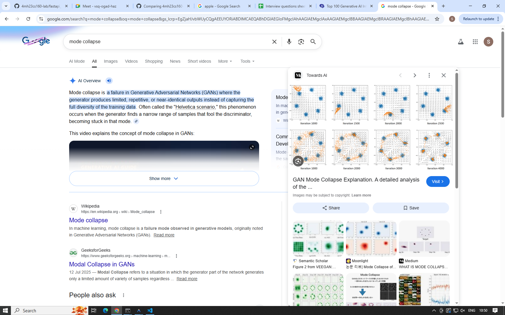

# 1. What is Generative AI?

Generative AI is a type of AI that is designed to generate new content, such as text, images, and audio, based on existing data. It is a subset of AI that is focused on creating new content, as opposed to AI that is focused on analyzing and understanding existing data.

# 2. What are the typical applications of Generative AI?
 
Generative AI has a wide range of applications, including:

Text generation: Generating new text based on existing text, such as articles, reports, and emails.
Image generation: Generating new images based on existing images, such as photos, videos, and graphics.
Audio generation: Generating new audio based on existing audio, such as music, speech, and sound effects.
Video generation: Generating new video based on existing video, such as movies, TV shows, and commercials.
# 3. What is a GAN?
A GAN, or Generative Adversarial Network, is a type of Generative AI that consists of two neural networks: a generator and a discriminator. The generator is responsible for creating new content, while the discriminator is responsible for evaluating the quality of the generated content. The two networks are trained together in an adversarial manner, where the generator tries to produce content that can fool the discriminator, and the discriminator tries to correctly identify real versus generated content. This process allows the generator to improve over time and produce increasingly realistic content.

# 4. Explain the structure of a GAN.
A GAN consists of two main components: the generator and the discriminator. The generator is a neural network that takes random noise as input and generates new content, such as images or text. The discriminator is another neural network that takes both real and generated content as input and tries to distinguish between the two. The generator and discriminator are trained together in an adversarial manner, where the generator tries to produce content that can fool the discriminator, and the discriminator tries to correctly identify real versus generated content. The training process continues until the generator produces content that is indistinguishable from real content, at which point the GAN is considered to have converged. The generator and discriminator can be implemented using various neural network architectures, such as convolutional neural networks (CNNs) for image generation or recurrent neural networks (RNNs) for text generation. The loss functions used for training the generator and discriminator can also vary, with common choices including binary cross-entropy loss and Wasserstein loss. For more information, you can refer to this link:    
https://aws.amazon.com/what-is/gan/#:~:text=A%20generative%20adversarial%20network%20system,network%20and%20the%20discriminator%20network.

# 5. What is a Variational Autoencoder (VAE)?
A Variational Autoencoder (VAE) is a type of Generative AI that is based on a neural network architecture. It is a type of Generative AI that is based on a neural network architecture. It is a type of Generative AI that is based on a neural network architecture.

# 6. How do GANs differ from VAEs?
GANs and VAEs are both types of Generative AI that are based on neural network architectures. However, they differ in their approach to generating new content. GANs use a discriminator to evaluate the quality of the generated content, while VAEs use a latent space to generate new content. GANs are typically used for generating high-quality content, while VAEs are typically used for generating more diverse content.

# 7. What is the latent space in generative models?
The latent space in generative models is a high-dimensional space that is used to represent the underlying structure of the data. It is a space that is used to generate new content based on existing data. The latent space is typically learned by the model during training, and it can be used to generate new content by sampling from the latent space.
# 8. What are the main challenges in training GANs?
The main challenges in training GANs include:
Mode collapse: This occurs when the generator produces a limited variety of outputs, leading to a lack of diversity in the generated content.
Training instability: GANs can be difficult to train, and they can be sensitive to hyperparameters and the architecture of the generator and discriminator networks.
Evaluation: Evaluating the quality of the generated content can be difficult, and there is no standard way to measure the performance of GANs.
# 9. What is mode collapse?
Mode collapse is a common problem in GANs where the generator produces a limited variety of outputs, leading to a lack of diversity in the generated content. This can occur when the generator learns to produce a small set of outputs that are highly similar to each other, rather than learning to produce a wide range of outputs. Mode collapse can be caused by a variety of factors, including an imbalance between the generator and discriminator networks, and it can be difficult to overcome.

# 10. How can mode collapse be mitigated?
Mode collapse can be mitigated through several techniques:
1. Using techniques like spectral normalization or gradient penalty to stabilize training.
2. Employing different loss functions such as Wasserstein loss.
3. Increasing the diversity of the training data.
4. Using techniques like minibatch discrimination or instance noise to encourage diversity in generated samples.
5. Implementing architectural changes to the generator and discriminator networks to promote diversity in the generated content.
# 11. What is the role of the discriminator in a GAN?
The discriminator in a GAN is a neural network that is trained to distinguish between real and fake data. It provides feedback to the generator by evaluating the quality of the generated data, helping the generator improve over time. The discriminator essentially acts as a critic, providing a signal that guides the generator towards producing more realistic data.
# 12. What is overfitting in generative models?
Overfitting in generative models occurs when the model learns to generate data that is too closely tied to the training data, rather than learning to generalize to new, unseen data. This can lead to a lack of diversity in the generated content and poor performance on new data. Overfitting can be mitigated through techniques such as regularization, early stopping, and using a larger and more diverse training dataset.
# 13. How can overfitting be prevented in generative models?
Overfitting in generative models can be prevented through several techniques:  
1. Regularization: Adding a penalty to the loss function to discourage the model from fitting the training data too closely.
2. Early stopping: Monitoring the performance of the model on a validation set and stopping training when performance starts to degrade.
3. Data augmentation: Increasing the diversity of the training data by applying transformations such as rotation, scaling, and flipping to the existing data.
4. Using a larger and more diverse training dataset to help the model learn to generalize better.
5. Implementing dropout or other techniques to prevent the model from relying too heavily on specific features of the training data.
# 14. What are some ways to prevent overfitting in generative AI models?
Some ways to prevent overfitting in generative AI models include:
1. Regularization: Adding a penalty to the loss function to discourage the model from fitting the training data too closely.
2. Early stopping: Monitoring the performance of the model on a validation set and stopping training when performance starts to degrade.
3. Data augmentation: Increasing the diversity of the training data by applying transformations such as rotation, scaling, and flipping to the existing data.
4. Using a larger and more diverse training dataset to help the model learn to generalize better.
5. Implementing dropout or other techniques to prevent the model from relying too heavily on specific features of the training data.
6. Cross-validation: Using techniques like k-fold cross-validation to evaluate the model's performance on different subsets of the data, which can help identify and mitigate overfitting.
7. Ensemble methods: Combining the predictions of multiple models to reduce the risk of overfitting by averaging their outputs, which can help improve generalization.  
# 15. What is the purpose of using noise in GANs?
The purpose of using noise in GANs is to provide a source of randomness that allows the generator to produce a wide variety of outputs. The noise is typically sampled from a simple distribution, such as a Gaussian distribution, and it serves as the input to the generator. By varying the noise input, the generator can produce different outputs, which helps to promote diversity in the generated content and prevents mode collapse.
# 16. What is a conditional GAN (cGAN)?
A conditional GAN (cGAN) is a type of GAN that is designed to generate data conditioned on specific input. In a cGAN, both the generator and discriminator receive additional information, such as class labels or other attributes, which allows the generator to produce outputs that are specific to the given conditions. This enables cGANs to generate more targeted and relevant content based on the provided input, making them useful for tasks such as image-to-image translation, text-to-image generation, and other applications where control over the generated output is desired.
# 17. How do cGANs differ from standard GANs?
cGANs differ from standard GANs in that they incorporate additional information (such as class labels or attributes) into both the generator and discriminator. This allows cGANs to generate specific outputs conditioned on the provided input, whereas standard GANs generate outputs without any conditioning on specific inputs. This makes cGANs more versatile for tasks that require control over the generated content, such as image-to-image translation or text-to-image generation, while standard GANs are typically used for generating more general content without specific conditions.
# 18.What is an autoencoder?
An autoencoder is a type of neural network that is designed to learn a compressed representation of input data. It consists of two main components: an encoder, which compresses the input data into a lower-dimensional latent space, and a decoder, which reconstructs the original data from the compressed representation. Autoencoders are often used for tasks such as dimensionality reduction, feature learning, and generative modeling. They can be trained in an unsupervised manner, meaning they do not require labeled data for training.
# 19.What is the difference between an autoencoder and a VAE?
The main difference between an autoencoder and a Variational Autoencoder (VAE) is that a VAE incorporates a probabilistic approach to learning the latent space. In a standard autoencoder, the encoder learns to compress the input data into a deterministic latent representation, while in a VAE, the encoder learns to represent the input data as a distribution over the latent space. This allows VAEs to generate new data by sampling from the learned distribution, whereas standard autoencoders do not have this capability. Additionally, VAEs typically use a different loss function that includes a regularization term to encourage the latent space to follow a specific distribution, such as a Gaussian distribution.
# 20.What are deepfakes?
Deepfakes are synthetic media generated using Generative AI techniques, particularly GANs, to create realistic but fake images, videos, or audio. They are often used to manipulate or fabricate content, such as creating videos of people saying or doing things they never actually did. Deepfakes can be used for various purposes, including entertainment, satire, and malicious activities like misinformation and identity theft. The technology behind deepfakes has raised ethical concerns due to its potential for misuse and the challenges it poses in distinguishing real from fake content.
# 21.What is the ethical concern surrounding deepfakes?
The ethical concern surrounding deepfakes is primarily related to their potential for misuse and the harm they can cause. Deepfakes can be used to create misleading or false content, such as fake news, impersonation, and non-consensual explicit material. This can lead to issues such as defamation, privacy violations, and the spread of misinformation. Additionally, deepfakes can undermine trust in media and make it difficult for people to discern real from fake content, which can have broader societal implications. The ethical concerns also extend to the potential for deepfakes to be used in political manipulation, cyberbullying, and other malicious activities.
# 22. What is data augmentation, and why is it essential in generative AI?
Data augmentation is a technique used to increase the diversity of the training data by applying various transformations to the existing data. This can include operations such as rotation, scaling, flipping, cropping, and adding noise. Data augmentation is essential in generative AI because it helps to prevent overfitting by providing the model with a wider variety of examples to learn from. By augmenting the data, the model can learn to generalize better to new, unseen data, which can improve the quality and diversity of the generated content. Additionally, data augmentation can help to address class imbalance in the training data, ensuring that the model has sufficient examples of all classes to learn from effectively.
# 23.How is Generative AI different from traditional AI?
Generative AI differs from traditional AI in that it focuses on creating new content, such as text, images, and audio, based on existing data, while traditional AI is typically focused on analyzing and understanding existing data. Generative AI uses techniques like GANs and VAEs to generate new content, whereas traditional AI may use techniques like classification, regression, and clustering to analyze and make predictions based on existing data. Additionally, generative AI often involves a more creative aspect, as it is designed to produce novel outputs, while traditional AI is more focused on tasks that involve pattern recognition and decision-making based on existing information.
# 24.Why do we need generative AI?
Generative AI is needed for several reasons:
1. Creativity: Generative AI can be used to create new content, such as art,            music, and literature, which can enhance creativity and provide new forms of expression.
2. Data augmentation: Generative AI can be used to generate additional training data for machine learning models, which can improve their performance and generalization.
3. Personalization: Generative AI can be used to create personalized content, such as recommendations and advertisements, based on individual preferences and behaviors.
4. Simulation and modeling: Generative AI can be used to simulate complex systems and generate synthetic data for research and analysis, which can help to advance scientific understanding and inform decision-making.
5. Entertainment: Generative AI can be used to create new forms of entertainment, such as video games, virtual reality experiences, and interactive media, which can provide new and engaging experiences for users.    
# 25.What is self-attention?
Self-attention is a mechanism used in neural networks, particularly in transformer architectures, that allows the model to weigh the importance of different parts of the input data when generating output. It works by computing a set of attention scores for each element in the input sequence, which indicate how much attention should be paid to each element when processing the data. This allows the model to capture long-range dependencies and relationships between different parts of the input, which can improve the quality and coherence of the generated content. Self-attention is a key component of many state-of-the-art generative models, such as GPT and BERT, and has been instrumental in advancing the capabilities of generative AI.
# 26.What is a language model?
A language model is a type of generative AI model that is designed to understand and generate human language. It is trained on large amounts of text data and learns to predict the next word or sequence of words based on the context of the input. Language models can be used for a variety of tasks, including text generation, machine translation, sentiment analysis, and question-answering. They are typically based on neural network architectures, such as transformers, and have been instrumental in advancing natural language processing (NLP) capabilities in generative AI.
# 27.What is the difference between a language model and a generative model?
A language model is a specific type of generative model that is focused on understanding and generating human 
language. While a generative model can be designed to generate various types of content, such as images, audio, and video, a language model is specifically trained on text data and is designed to predict the next word or sequence of words based on the context of the input. In contrast, a generative model may use different architectures and techniques depending on the type of content it is designed to generate, while a language model typically uses neural network architectures like transformers to process and generate text.     